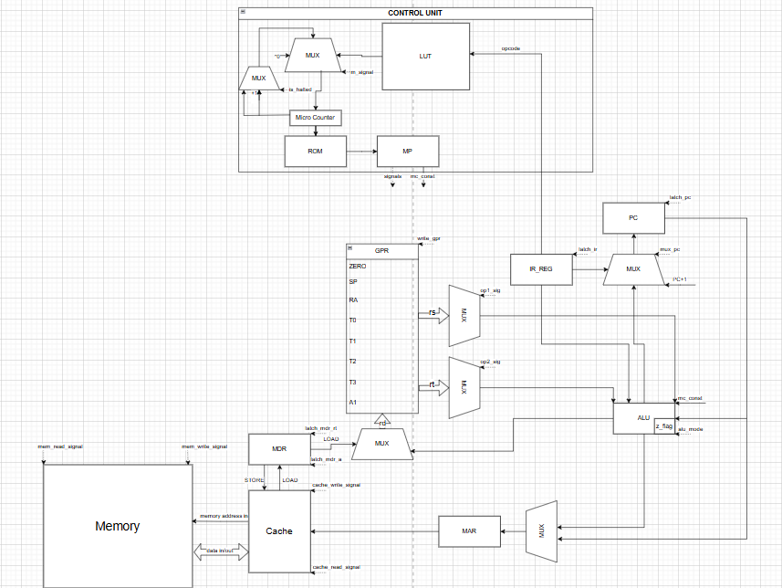
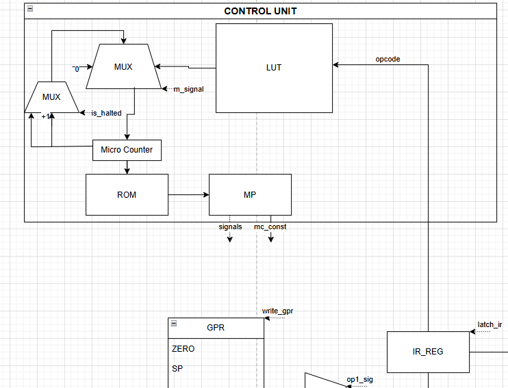
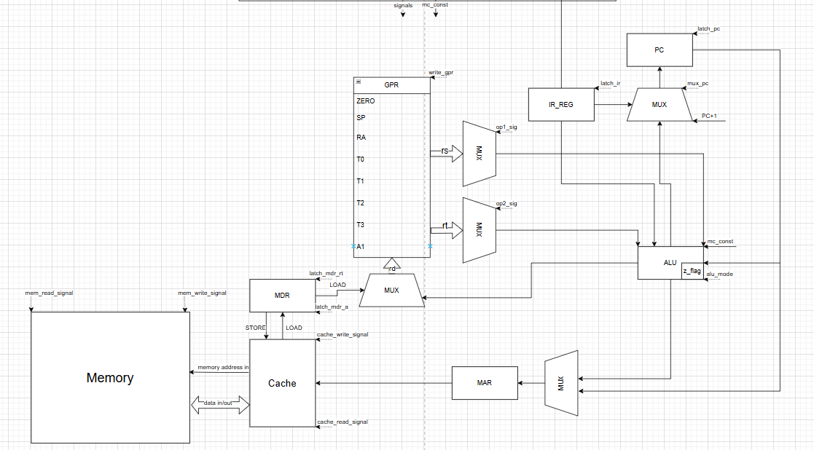

# RISC-Vorth

**Студент:** Дмитриев Денис Сергеевич, группа P3212
**Вариант:** `forth | risc | neum | mc | tick | binary | stream | mem | pstr | prob2 | cache`

## Язык программирования `Forth`

Язык Forth реализован как подмножество стандартного Forth, ориентированное на стековую архитектуру.

### Синтаксис (Расширенная форма Бэкуса-Наура):

```ebnf
<программа>             ::= { <строка> }
<строка>                ::= <определение_слова> 
                        | <определение_переменной> 
                        | <исполняемый_токен> { <исполняемый_токен> } 
                        | <комментарий> 
                        | <пустая_строка>

<комментарий>           ::= '\' <любые_символы_до_конца_строки> '\n'
<пустая_строка>         ::= <пробел>* '\n'

<определение_слова>     ::= ':' <имя_слова> { <токен> } ';'
<определение_переменной>::= ('VARIABLE' | 'CREATE') <имя_переменной> ['ALLOT' <число>]

<токен>                 ::= <число>
                        | <символ_литерал>
                        | <строка_литерал>
                        | <имя_из_словаря_слов>
                        | <управляющая_структура_FORTH>
                        | <любое_другое_слово>

<имя_слова>             ::= <идентификатор>
<имя_переменной>        ::= <идентификатор>
<идентификатор>         ::= ( <буква> | <цифра> | '-' | '_' | '<' | '>' | '@' | '!' | '+' | '*' | '=' | '/' )+

<число>                 ::= [ '-' ] <десятичное_число>
                        | '0x' <шестнадцатеричное_число>
                        | '0b' <двоичное_число>
<десятичное_число>      ::= <цифра>+
<шестнадцатеричное_число>::= ( <цифра> | 'A'..'F' | 'a'..'f' )+
<двоичное_число>        ::= ('0' | '1')+
<цифра>                 ::= '0'..'9'
<буква>                 ::= 'a'..'z' | 'A'..'Z'

<символ_литерал>        ::= '[CHAR]' <любой_символ_без_пробела>

<строка_литерал>        ::= 'S"' <содержимое_строки> '"'
<содержимое_строки>     ::= ( <любой_символ_кроме_двойной_кавычки> )*

<управляющая_структура_FORTH> :: = 'IF' | 'ELSE' | 'THEN'
                               | 'BEGIN' | 'WHILE' | 'REPEAT'
                               | 'BEGIN' | 'UNTIL'
```

### Пояснения к синтаксису и семантике:

-   **Токены**: Программа состоит из слов (токенов), разделенных пробелами. Токены обрабатываются слева направо.
-   **Стековая модель**: Все операции используют общий стек данных (Data Stack) для аргументов и результатов. Результаты операций помещаются обратно на стек. Процессор имеет отдельный Stack Pointer (`SP`) для стека вызовов и `data_sp` для стека данных.
-   **Определения слов**: Новый функционал (процедуры) создается с помощью `: <имя> ... ;`. Тело слова — это последовательность токенов, которые выполняются при вызове слова. `EXIT` возвращает управление из слова.
-   **Переменные (`VARIABLE`, `CREATE ALLOT`)**: Создают именованные ячейки в памяти данных. При упоминании имени переменной ее адрес помещается на стек. `!` (store) записывает значение в память по адресу со стека. `@` (fetch) читает значение из памяти.
-   **Литералы**: Числа (`42`, `0xABC`, `0b101`), символы (`[CHAR] A`) и строки (`S"hello"`) напрямую помещают свои значения/адреса на стек. Строки хранятся в формате P-string (первое слово содержит длину, затем следуют символы, по одному символу на слово).
-   **Ввод-вывод**: `KEY` помещает на стек ASCII-код следующего символа из входного потока. `EMIT` печатает символ, ASCII-код которого находится на вершине стека.
-   **Управление потоком**: `IF...ELSE...THEN`, `BEGIN...WHILE...REPEAT`, `BEGIN...UNTIL` управляют ходом выполнения, генерируя условные/безусловные переходы. `HALT` останавливает выполнение программы.
-   **Область видимости**: Все слова и переменные имеют глобальную область видимости.

## Организация памяти

Архитектура памяти реализует **фон-Неймановскую** модель, где инструкции программы и данные хранятся в едином, общем адресном пространстве памяти.

*   **Машинное слово**: 32 бита (4 байта) как для инструкций, так и для данных.
*   **Адресация**: Линейное адресное пространство от `0x0000` до `MEMORY_SIZE - 1` (64K слов, 256KB).
*   **Кеш-память**: Единая `direct-mapped cache` обслуживает запросы как к памяти инструкций, так и к памяти данных.

### Схема организации памяти:

```text
           Общая Память (64K слов, 256 KB)
  +---------------------------------------+ 0x0000 (адрес начала)
  | Код программы (инструкции)            |
  |  - Инструкция JMP _start (транслятор |
  |    генерирует для входа)              |
  |  - Генерируемые Forth-подпрограммы     |
  |  - Пользовательские Forth-слова        |
  |  - Основной Forth-код                  |
  | ...                                   |
  +---------------------------------------+ <-- Конец кода
  | Секция статических данных             |
  |  - Определённые VARIABLE (1 слово/переменная)|
  |  - Строковые литералы (P-string:      |
  |    длина (1 слово), затем символы     |
  |    (1 символ = 1 слово))              |
  | ...                                   |
  +---------------------------------------+ <-- Конец статических данных
  |                                       |
  |   Свободное пространство памяти       |
  |                                       |
  +---------------------------------------+ ~0xF444 (MEMORY_SIZE - 5000, 60536)
  | Стек данных (Data Stack)              | <- Текущая вершина data_sp
  |  - Элементы, добавляемые Forth-словами|
  | ...                                   |
  +---------------------------------------+ ~0xFFF4 (MEMORY_SIZE - 1000, 64536)
  | Стек вызовов (Call Stack)             | <- Текущая вершина SP
  |  - Адреса возврата процедур            |
  | ...                                   |
  +---------------------------------------+ 0xFF00 (IO_INPUT_PORT, 65280)
  | Порты ввода-вывода (Memory-Mapped I/O)|
  | 0xFF00: Порт ввода                    |
  | 0xFF01: Порт вывода                   |
  +---------------------------------------+ 0xFFFF (MEMORY_SIZE - 1, конец памяти)
```

## Система команд (RISC)

Процессор реализует систему команд RISC с фиксированной длиной инструкции (32 бита).

### Вот такие особенности:

-   **Фиксированная длина инструкции**: Все инструкции имеют длину 32 бита.
-   **Регистровая архитектура**: Операции над данными в основном производятся между регистрами общего назначения. Доступ к памяти — только через специальные инструкции `LOAD`/`STORE`.
-   **Тактовая точность**: Каждая машинная инструкция раскладывается на несколько микро-операций. Каждый такт симуляции соответствует выполнению одной микро-операции.

### Регистры (8 штук, 32-битные):

-   `ZERO` (0): Регистр, всегда содержащий ноль (Read-Only).
-   `SP` (1): Stack Pointer, указывает на вершину **стека вызовов** (адресов возврата).
-   `RA` (2): Return Address, используется для сохранения адреса возврата в `CALL`.
-   `T0` (3), `T1` (4), `T2` (5), `T3` (6): Временные регистры общего назначения.
-   `A1` (7): Регистр общего назначения, используется для аргументов/возвращаемых значений.

*(Примечание: Помимо программируемых регистров GPR, есть внутренние служебные регистры процессора: `PC` (Program Counter), `MAR` (Memory Address Register), `MDR` (Memory Data Register), `IR_REG` (Instruction Register) и `data_sp` (Data Stack Pointer), которые проогеру Forth недоступны, но играют роль в тракте данных, оно же DataPath.)*

### Набор инструкций (опкоды):

1.  **Системные инструкции**:
    *   `NOP (0x00)`: Нет операции.
    *   `HALT (0x01)`: Останавливает выполнение процессора.

2.  **Арифметические и логические (R-type)**: `rd <- rs OP rt`
    *   `ADD (0x10)`: Сложение
    *   `SUB (0x11)`: Вычитание
    *   `MUL (0x12)`: Умножение (младшие 32 бита результата)
    *   `DIV (0x13)`: Целочисленное деление
    *   `MOD (0x14)`: Остаток от деления
    *   `AND (0x15)`: Битовое И
    *   `OR (0x16)`: Битовое ИЛИ
    *   `XOR (0x17)`: Битовое XOR
    *   `CMP (0x18)`: Сравнение (rd <- 1, если rs == rt; иначе 0)
    *   `SHL (0x19)`: Логический сдвиг влево
    *   `SHR (0x1A)`: Логический сдвиг вправо

3.  **Инструкции с константой (I-type)**:
    *   `ADDI (0x20)`: `rt <- rs + imm16` (сложение с 16-битной знаковой константой).
    *   `LOAD (0x21)`: `rt <- mem[rs + imm16]` (загрузка слова из памяти).
    *   `STORE (0x22)`: `mem[rs + imm16] <- rt` (запись слова в память).
    *   `JZ (0x23)`: `if rt == 0 then pc <- pc + imm16` (условный переход, если регистр `rt` равен нулю).
    *   `JNZ (0x24)`: `if rt != 0 then pc <- pc + imm16` (условный переход, если регистр `rt` не равен нулю).
    *   `LUI (0x25)`: `rt <- imm16 << 16` (загрузка старших 16 бит регистра).
    *   `ORI (0x26)`: `rt <- rs | imm16` (битовое ИЛИ с константой).

4.  **Инструкции работы со стеками (в контексте Forth)**:
    *   `PUSH (0x30)`: `mem[data_sp-1] <- rs; data_sp <- data_sp-1`. Кладёт значение из регистра `rs` на стек данных.
    *   `POP (0x31)`: `rt <- mem[data_sp]; data_sp <- data_sp+1`. Снимает значение со стека данных в `rt`.

5.  **Переходы и вызовы процедур (J-type / Специальные)**:
    *   `JMP (0x32)`: `pc <- addr` (безусловный переход).
    *   `CALL (0x33)`: `mem[SP-1] <- pc+1; SP <- SP-1; pc <- addr` (вызов процедуры: сохраняет адрес возврата на **стеке вызовов** и переходит).
    *   `RET (0x34)`: `pc <- mem[SP]; SP <- SP+1` (возврат из процедуры: восстанавливает адрес из **стека вызовов**).

## Кодирование инструкций 

Каждая машинная инструкция имеет фиксированную длину 32 бита. Старшие 6 бит всегда кодируют Opcode.

```text
  ┌─────────┬─────────────────────────────┐  Общий формат
  │ 31...26 │          25...0             │
  ├─────────┼─────────────────────────────┤
  │ Opcode  │    Зависит от типа Instr    │
  └─────────┴─────────────────────────────┘

  Форматы:
  R-type (например, ADD, SUB, MUL):     [Opcode:6][rs:5][rt:5][rd:5][unused:11]
  I-type (например, ADDI, LOAD, STORE): [Opcode:6][rs:5][rt:5][imm:16]
  J-type (например, JMP, CALL):         [Opcode:6][addr:26]
  Special (PUSH/POP/RET/HALT/NOP):      [Opcode:6][различные поля]
```


## Микрокоманды (Control Unit)

Управляющее устройство (в данном случае Control Unit) является микрокомандным. Каждая машинная инструкция раскладывается на последовательность элементарных **микро-операций** (`MicroOp`), каждая из которых выполняется за один такт. Это обеспечивает детальную тактовую точность симуляции и гибкость в расширении инструкций.

Микрокод хранится в виде словаря внутри симулятора, отображая каждый Opcode на список `MicroOp`.

**Стандартный цикл выборки (Fetch Cycle) инструкции:**

1.  `LATCH_MAR_PC`: Адрес следующей инструкции из `PC` защелкивается в `MAR`.
2.  `CACHE_READ`: Чтение данных из памяти/кеша по адресу в `MAR`. Результат в `MDR`.
3.  `LATCH_PC_INC`: `PC` инкрементируется.
4.  `LATCH_IR`: Содержимое `MDR` (выбранная инструкция) защелкивается в `IR`.

После Fetch Cycle, специфическая микропрограмма для текущей инструкции выполняется до `FINISH_INSTRUCTION`. Задержки кеша (stalls) моделируются путем "пропуска" тактов.

**Примеры категорий микро-операций (`MicroOp`)**:
(Описывают базовые действия аппаратного уровня, управляемые Control Unit)
-   **PC Control**: `LATCH_PC_INC`, `LATCH_PC_ADDR`, `LATCH_PC_ALU`
-   **Memory/Register Latching**: `LATCH_MAR_PC`, `LATCH_MAR_ALU`, `LATCH_IR`, `LATCH_MDR_RT`, `LATCH_MDR_A`
-   **ALU Input Latching**: `LATCH_A_RS`, `LATCH_A_RT`, `LATCH_A_SP`, `LATCH_A_PC`, `LATCH_A_MDR`, `LATCH_B_RT`, `LATCH_B_IMM`, `LATCH_B_CONST_1`
-   **ALU Output Latching**: `LATCH_RD_ALU`, `LATCH_RT_ALU`, `LATCH_RT_MDR`, `LATCH_SP_ALU`
-   **ALU Operations**: `ALU_ADD`, `ALU_SUB`, `ALU_MUL`, `ALU_DIV`, `ALU_MOD`, `ALU_OR`, `ALU_AND`, `ALU_XOR`, `ALU_CMP`, `ALU_SHL`, `ALU_SHR`, `ALU_LUI`
-   **Branch Control**: `BRANCH_IF_ZERO`, `BRANCH_IF_NOT_ZERO`
-   **Cache/System**: `CACHE_READ`, `CACHE_WRITE`, `HALT_PROCESSOR`, `FINISH_INSTRUCTION`

## АЛУ

Блок арифметико-логического устройства (АЛУ) выполняет операции над входными значениями из регистров `alu_a` и `alu_b` DataPath, помещая результат в `alu_out`. Флаг `zero_flag` устанавливается, если результат равен нулю.

**Режимы работы АЛУ** (связанные с `MicroOp.ALU_`):
-   `ALU_ADD`: `alu_a + alu_b`
-   `ALU_SUB`: `alu_a - alu_b`
-   `ALU_MUL`: `alu_a * alu_b`
-   `ALU_DIV`: `alu_a // alu_b` (целочисленное)
-   `ALU_MOD`: `alu_a % alu_b` (остаток)
-   `ALU_OR`, `ALU_AND`, `ALU_XOR`: Битовые операции
-   `ALU_CMP`: Сравнение (`1` если `alu_a == alu_b`, иначе `0`)
-   `ALU_SHL`, `ALU_SHR`: Логические сдвиги
-   `ALU_LUI`: `alu_b << 16`

## Модуль условий

Forth-операции сравнения (`=`, `<>`, `<`, `>`, `<=`, `>=`) реализуются:
-   С использованием соответствующих инструкций ISA (`CMP`, `SUB`, `SHR`) для получения числового результата (0, 1 или знакового бита).

## Модуль памяти данных (Memory-Mapped I/O)

Реализация ввода-вывода (I/O) через Memory-Mapped I/O (MMIO) интегрирована в единую модель основной памяти.

*   **Принцип работы**: При любой операции `LOAD` или `STORE` к адресам `IO_INPUT_PORT` (`0xFF00`) или `IO_OUTPUT_PORT` (`0xFF01`), операция перехватывается и данные перенаправляются на взаимодействие с внутренними I/O буферами симулятора (т.е., читается из буфера ввода или записывается в буфер вывода симулятора). В остальных случаях происходит обычное чтение/запись из основной памяти.
*   **Ширина данных**: Операции с MMIO портами обрабатывают данные как 32-битные слова.

## Транслятор
* "Использование: python translator.py <file.f> <data.bin>"
* Работает в несколько прогонов
## Модель процессора


Control Unit:


DataPath:



## Тестирование

Корректность работы системы и демонстрация возможностей достигаются с помощью интеграционных **Golden Tests**, организованных с использованием фреймворка `pytest` и `pytest-golden`.

### Тесты:

**Список реализованных Golden Tests:**

1.  **`hello.yml`**: Программа "Hello, World!", проверяющая базовый вывод строк.
2.  **`cat.yml`**: буквально echo программа, которая читает ввод пользователя и выводит его обратно, демонстрируя работу с вводом-выводом.
3.  **`hello_user.yml`**:  программа "Hello, Username!", показывающая ввод пользователя и форматированный вывод.
4.  **`sort.yml`**: Реализация алгоритма пузырьковой сортировки массива чисел, включая чтение чисел из ввода и вывод отсортированного списка.
5.  **`prob6.yml`**: Решение задачи №6 из Проекта Эйлера ("Find the difference between the sum of the squares and the square of the sum of first 100 natural numbers").
6.  **`double_add.yml`**: Тест на 64-битную арифметику (сложение двух 64-битных чисел).
7.  **`cache_test.yml`**: Демонстрация влияния кеш-памяти на производительность.


